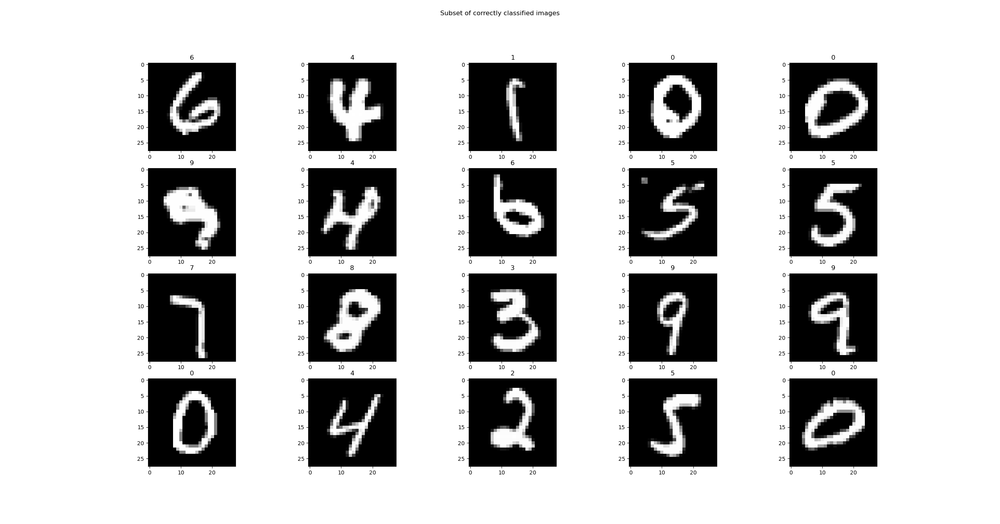
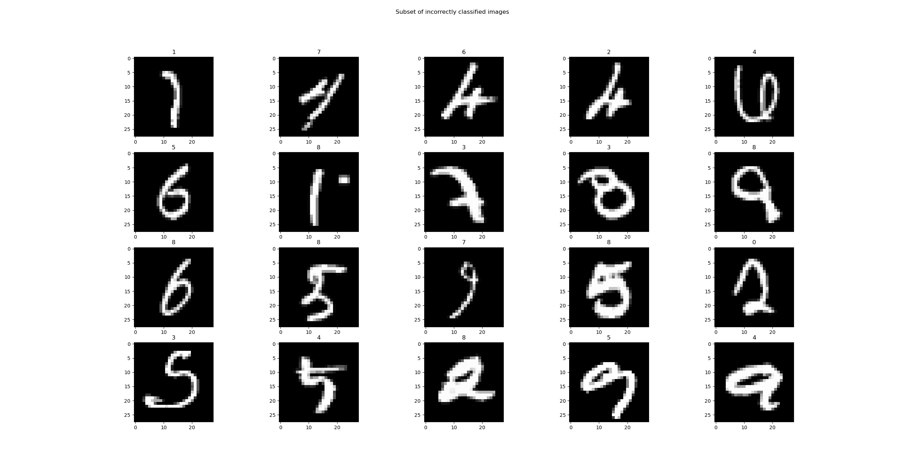

# ArtificialNeuralNetwork

A handwritten-digit classifier application. Trains and evaluates a classifier on the MNIST dataset. Currently not much
fun since it do not accept handwritten digits from the user. This project was inspired by the book "Neural Networks
and Deep Learning": http://neuralnetworksanddeeplearning.com/index.html.

# Usage

```
$ python main.py --help
usage: main.py [-h] [-c {mlp,cnn}] [-t] [-a] [-n N] [-e] [-x]

Handwritten-digit classifier.

optional arguments:
  -h, --help    show this help message and exit
  -c {mlp,cnn}  classifier backbone (default: mlp)
  -t            train the classifier (default: False)
  -a            use data augmentation (default: False)
  -n N          use only every N:th training sample (default: 1)
  -e            evaluate the classifier (default: False)
  -x            visualize images (default: False)
```

Start by running the application using the `-t` argument to train a classifier, possibly with the `-e` argument for
evaluation after each training epoch. Note that the training will take a long time to complete. Once the classifier is
trained run with `-e` to evaluate on the test dataset or `-x` to visualize subsets of correctly and incorrectly
classified images.

## Example

```
$ python main.py -x
```

Example of correctly classified digits:


Example of incorrectly classified digits:


## Test

Stand in the root of the project.
```
$ python -m pytest
============================= test session starts =============================
platform win32 -- Python 3.5.3, pytest-3.0.7, py-1.4.33, pluggy-0.4.0
rootdir: D:\PycharmProjects\ArtificialNeuralNetwork, inifile:
collected 10 items

artificialneuralnetwork\network\tests\cnn_test.py ......
artificialneuralnetwork\network\tests\mlp_test.py ....

========================== 10 passed in 8.85 seconds ==========================
```

## Dependencies

* matplotlib
* numpy
* scipy

# Algorithm

The core of the application is the artificial neural network, either a multilayer perceptron (MLP) network or a
convolutional neural network (CNN). It is able to learn from example data using the stochastic gradient descent
algorithm. Backpropagation is used for calculating the partial derivatives of the gradient. The network can then
feedforward (run) an input through the network, producing the (hopefully) expected output.

## Details

An artificial neural network is basically a function of many variables (the weights and biases), `F(w,b)`. A cost
function, `C(F(w,b), Y)`, is used for determine the distance between the actual output and the expected ground truth
`Y`. The goal of training a network is to minimize this cost function.

The minimization technique used is gradient descent. This technique calculates the gradient (the partial derivative of
each variable) of a function (in this case the cost function) and then takes a step towards the negative gradient,
proportional to the gradient. This is repeated multiple times. The gradient is calculated using backpropagation, which
essentially is using the (derivative) chain rule starting from the cost function and then applying it backwards through
the network. Note that the gradient depends on all training examples, calculating it for all the steps would take too
much time. Therefore an approximation is used; only a (random) subset of the training examples is used in each
iteration. This is called stochastic gradient descent.

Also note that for the backpropagation algorithm to work, the cost function must be defined as an average of cost
functions for individual training examples. The cost function must also be a function of the outputs from the neural
network.

The batch size decides the size of the random subset, the learning rate decides the step size, and the number of epochs
decides the number of whole iterations through the training data.

## Artificial Neural Network Techniques

The application uses the following artificial neural network techniques:

 * Split dataset into training, validation (used for hyper parameter tuning) and test
 * Data augmentation
 * Babysitting training: visualization of loss and accuracy
 * Data preprocessing: zero center and normalization
 * Improved weight initialization
 * Weight regularization
 * Dropout regularization
 * Momentum
 * Learning rate decay

Other techniques to consider, currently not implemented:

 * Batch normalization
 * Adam optimizer
